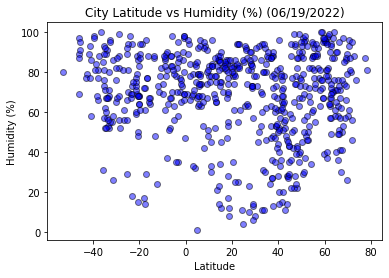

<!DOCTYPE html>
<html lang="en">

<head>
    <meta charset="UTF-8">

    <title>Web Visualisation Dashboard (Latitude)</title>
    <link rel="stylesheet" href="https://maxcdn.bootstrapcdn.com/bootstrap/3.3.7/css/bootstrap.min.css">
    <link rel="stylesheet" href="style.css">
</head>

<body>
    <nav class="navbar navbar-default">
        

            

                <a href="Landing.html"><strong>Latitude</strong></a>
                <button type="button" class="navbar-toggle" data-toggle="collapse" data-target="#navCollapse">
                    
                    
                    
                </button>

            

            

                <ul class="nav navbar-nav navbar-right">
                    <li class="dropdown">
                        <a href="#" class="dropdown-toggle" data-toggle="dropdown" role="button" aria-haspopup="true"
                            aria-expanded="false">Plots </a>
                        <ul class="dropdown-menu">
                            <li><a href="MaximumTemperature.html">Max Temperature</a></li>
                            <li><a href="Humidity.html">Humidity</a></li>
                            <li><a href="Cloudiness.html">Cloudiness</a></li>
                            <li><a href="WindSpeed.html">Wind Speed</a></li>
                        </ul>
                    </li>
                    <li><a href="Comparisons.html">Comparison</a></li>
                    <li><a href="Data.html">Data</a></li>
                </ul>
            

        

    </nav>

    

        

            

                <h1><strong> Summary: Latitude vs. X </strong></h1>
                

                 
                
                
The is project aims to analyze the weather changes that occur as you get closer to the equator. This was achieved by pulling data
                    from the OpenWeatherMap API to assemble a dataset of over 500 cities. 
                    Analyisis was carried out using JSON and Matplotlib to plot various aspects of the weather and latitude.
                

                

                    This site contains source data and outputs drawn from the analysis. 
                

            

            

                <h2><strong>Visualizations</strong></h2>
                

                
                
                
                
            

        

    

    
    
    
</body>

</html>